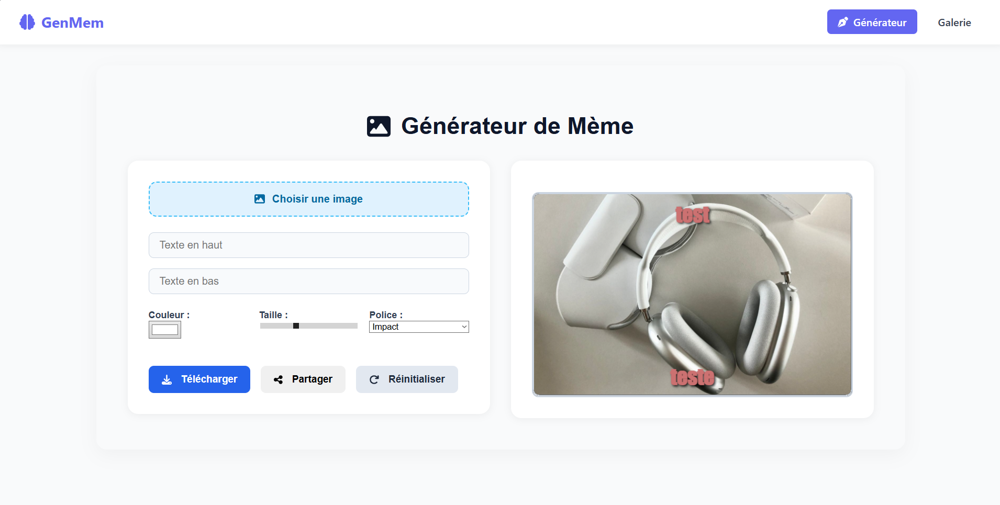
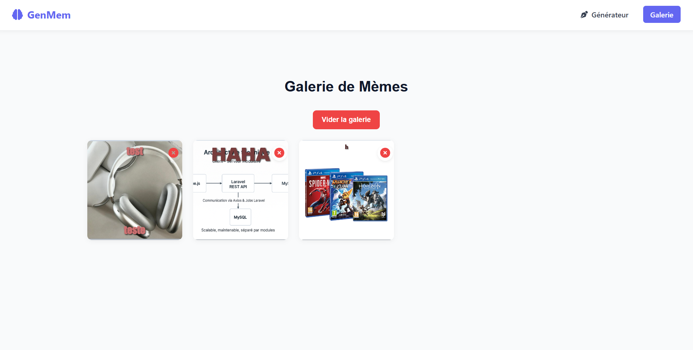

# MemeGen - Générateur de Mèmes en ligne

MemeGen est une application Vue 3 moderne et responsive permettant de créer, personnaliser, télécharger et sauvegarder des mèmes en toute simplicité. Elle offre une interface intuitive avec des fonctionnalités complètes, inspirée des standards professionnels.

## Démo

[Voir la démo en ligne](https://genmem.netlify.app)

## Fonctionnalités

- Upload d’image locale
- Ajout de texte en haut et en bas
- Personnalisation (taille, couleur, police)
- Téléchargement PNG
- Partage via Web API (si supporté)
- Mode édition WYSIWYG (texte modifiable directement sur le mème)
- Galerie locale persistante (LocalStorage)
- Interface responsive mobile/tablette
- Design moderne avec FontAwesome et SCSS modulaire

## Aperçu

| Générateur | Galerie |
|-----------|---------|
|  |  |

## Stack technique

- **Frontend** : [Vue 3](https://vuejs.org/), [Vue Router](https://router.vuejs.org/)
- **Icons** : [Font Awesome](https://fontawesome.com/)
- **Canvas** : [html2canvas](https://www.npmjs.com/package/html2canvas)
- **Styling** : CSS modulaire + media queries + SCSS-like structure

## Installation locale

```bash
git clone https://github.com/votre-user/memegen.git
npm install
npm run dev
````

## Build pour production

```bash
npm run build
```

> Le dossier `dist/` généré peut être déployé sur [Netlify](https://netlify.com).

## Arborescence

```
memegen/
│
├── public/
├── src/
│   ├── assets/
│   ├── components/
│   │   └── MemeEditor.vue
│   ├── views/
│   │   ├── Home.vue
│   │   └── Gallery.vue
│   ├── App.vue
│   ├── router/
│   │   └── index.js
│   └── main.js
├── README.md
├── package.json
└── vite.config.js
```

## Déploiement Netlify

1. Connecte ton repo à Netlify
2. **Build command** : `npm run build`
3. **Publish directory** : `dist/`

## Remerciements

Merci aux bibliothèques suivantes :

* [Vue.js](https://vuejs.org/)
* [Font Awesome](https://fontawesome.com/)
* [html2canvas](https://html2canvas.hertzen.com/)
* [Netlify](https://www.netlify.com/)

---
